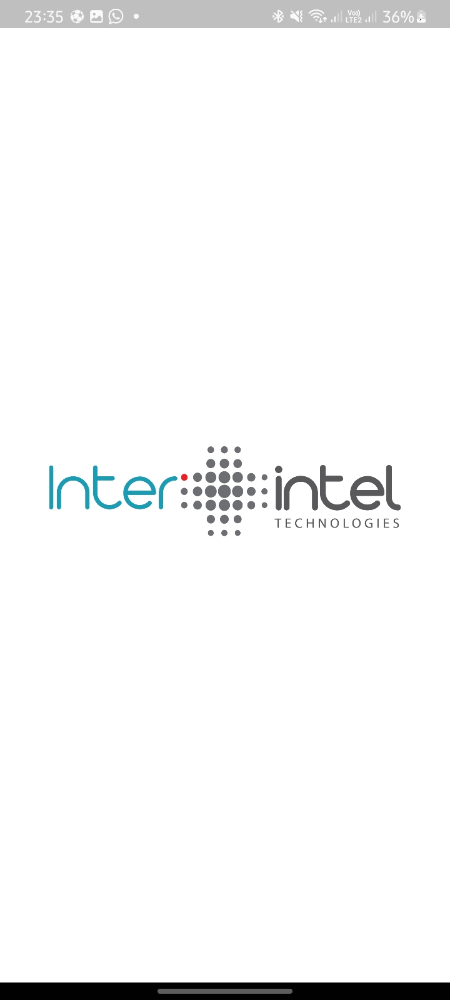
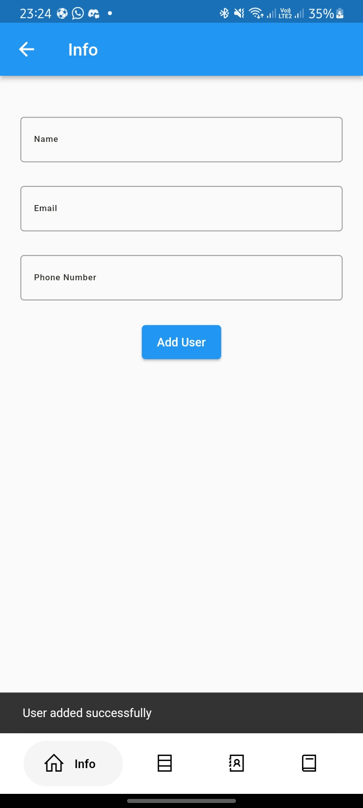
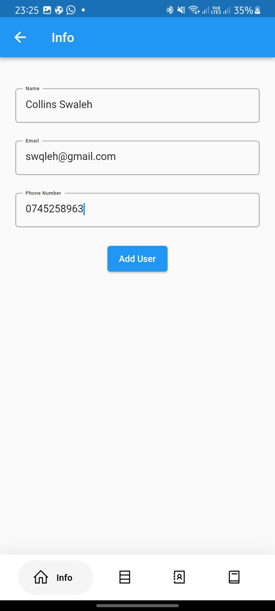
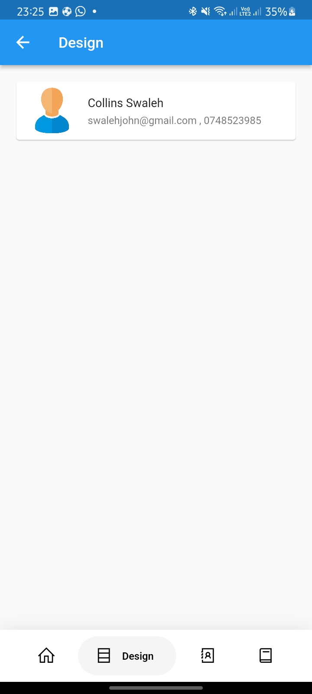
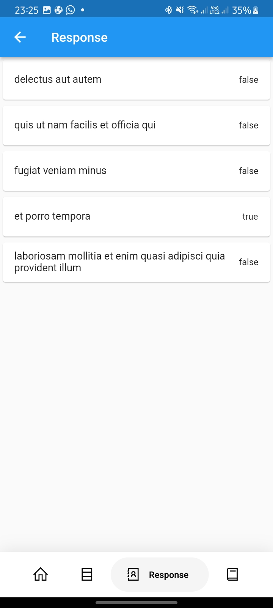
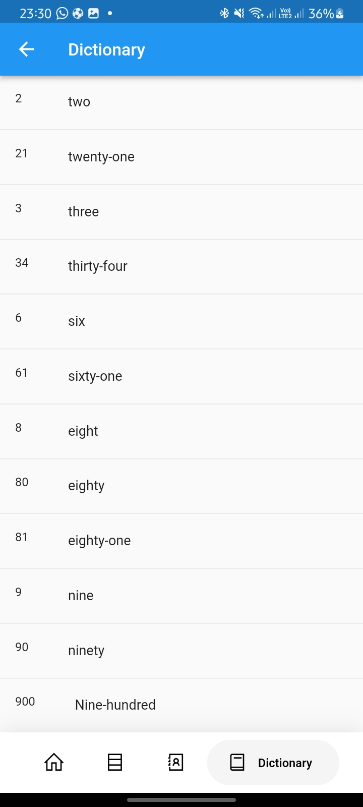

# interintel

A new Flutter project.

## Getting Started

This project is a starting point for a Flutter application.

A few resources to get you started if this is your first Flutter project:

- [Lab: Write your first Flutter app](https://docs.flutter.dev/get-started/codelab)
- [Cookbook: Useful Flutter samples](https://docs.flutter.dev/cookbook)

For help getting started with Flutter development, view the
[online documentation](https://docs.flutter.dev/), which offers tutorials,
samples, guidance on mobile development, and a full API reference.

# InterIntel Flutter Interview Test.

## Android Developer Pre-screening test

Timeline: Monday, Jan 9 - Wednesday, Jan 11 2022 (3 Days)

## Description
The mobile App will be able for the user to input his name, email, and phone number and will be shown in a different screen with a better design. Also, the app will be able to display response displays the todos’ in a
list indicating the todo title and the completed value.

## Achievments
- Incorporating bottom navigation bar.
- Form that captures a user basic information.
- Response displays the todos’ in a list indicating the todo title and the completed value.
- Dictionary screen Sort the below dictionary/array key using dart and output the information in key:value format on a card widget or any other display widget.
- Splash screen animation

## API Endpoints

- Base URL - https://jsonplaceholder.typicode.com/todos?_limit=5

Make a NETWORK POST request to this Google Form using any network library. [Retrofit is recommended.]
- Base url - https://jsonplaceholder.typicode.com/todos?_limit=5

## Tech stack
- MVVM (ViewModel, LiveData, Repository)
- Retrofit
- Json annotation
- Animations

## Project Demo

